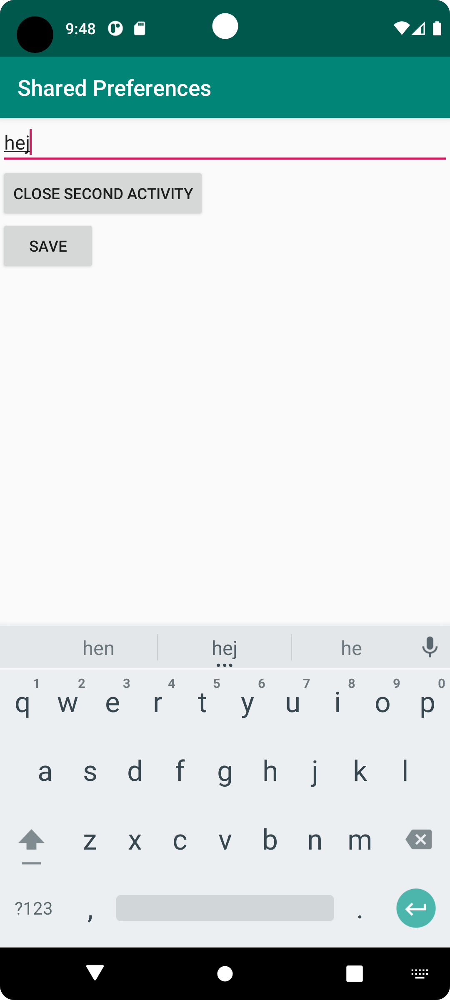

# Rapport

**Det första problemet i programmet löstes genom att skriva ett par rader av kod som skulle läsa in data med sharedpreferences och kodet skrevs i onCrete() i mainactivity.
Koden finns tillgänglig i kodsnippet. Det andra problemet löstes genom att skapa en annan screeen eller activity genom att skapa först en secondActivity java fil och en 
second_activity xml fil. Därefter implementerades lite kod i både de två filerna och mainActivity för att sammankoppla de genom att implementera en knapp i mainActivity
för att ta användaren till den andra activity och även en knapp som skulle ta användaren tillbaka från secondActivity till mainActivity. Det sista problemet löstes genom att
skriva data i secondActivity spara det och sedan skulle det finnas kvar i mainActivity vilket det gör och detta löstes helt enkelt genom att det implementerades lite kod i
alla fyra filerna för att få det hela att fungera som det skulle. Det som också gjordes var att istället för att läsa data i onCrete() implementerades det istället i onResume()
i mainActivty. Kodet finns i kodsnippet lite ner. **


Programkod ska se ut som exemplet nedan. Koden måste vara korrekt indenterad då den blir lättare att läsa vilket gör det lättare att hitta syntaktiska fel.

```
    protected void onResume() {
        super.onResume();

        myPreferenceRef = getSharedPreferences("MyPreferencesName", MODE_PRIVATE);
        myPreferenceEditor = myPreferenceRef.edit();

        // Read a preference
        prefTextRef = new TextView(this);
        prefTextRef = (TextView)findViewById(R.id.prefText);
        prefTextRef.setText(myPreferenceRef.getString("MyAppPreferenceString", "No preference found."));
    }

    public void savePref(View view){
        // Get the text
        EditText newPrefText = new EditText(this);
        newPrefText = (EditText)findViewById(R.id.settingseditview);

        // Store the new preference
        myPreferenceEditor.putString("MyAppPreferenceString", newPrefText.getText().toString());
        myPreferenceEditor.apply();

        newPrefText.setText("");
    }

```

Bilder läggs i samma mapp som markdown-filen.





Läs gärna:

- Boulos, M.N.K., Warren, J., Gong, J. & Yue, P. (2010) Web GIS in practice VIII: HTML5 and the canvas element for interactive online mapping. International journal of health geographics 9, 14. Shin, Y. &
- Wunsche, B.C. (2013) A smartphone-based golf simulation exercise game for supporting arthritis patients. 2013 28th International Conference of Image and Vision Computing New Zealand (IVCNZ), IEEE, pp. 459–464.
- Wohlin, C., Runeson, P., Höst, M., Ohlsson, M.C., Regnell, B., Wesslén, A. (2012) Experimentation in Software Engineering, Berlin, Heidelberg: Springer Berlin Heidelberg.
